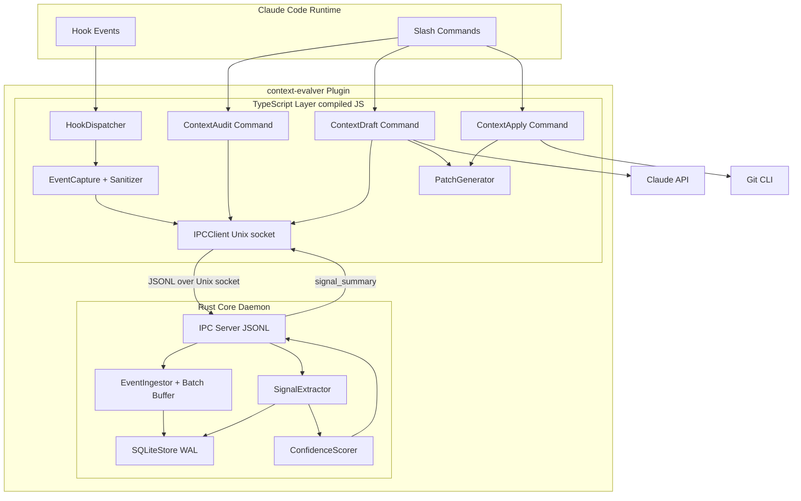
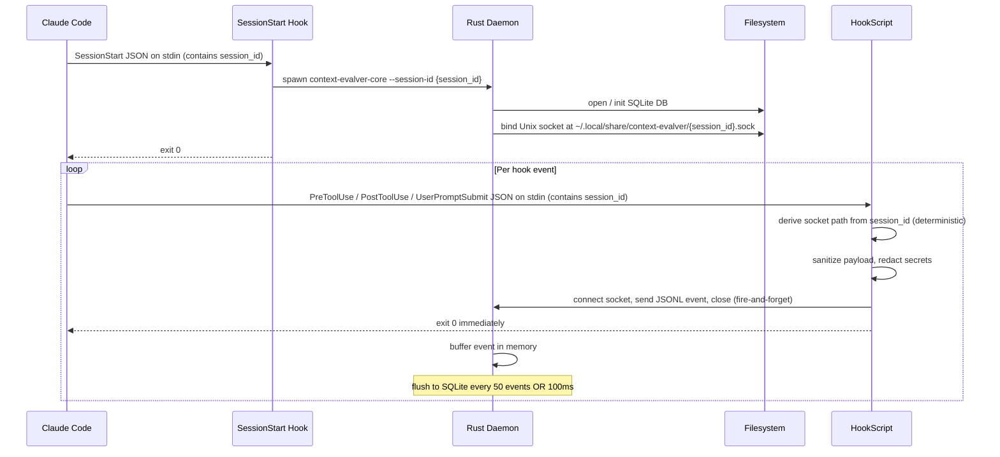
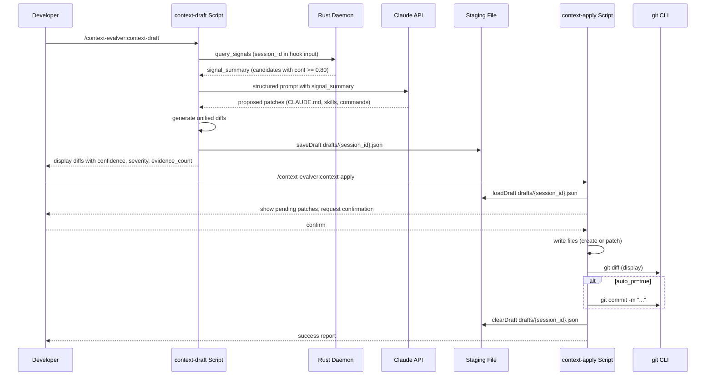

# Technical Design: context-evalver (initial-development)

---

## Overview

**Purpose**: `context-evalver` is a Claude Code plugin that silently observes developer session behavior, persists events to SQLite, and proposes repository context improvements (CLAUDE.md updates, Skills, slash commands) only when statistical evidence meets confidence thresholds.

**Users**: Individual developers using Claude Code will gain automated, evidence-driven suggestions for improving their repository's AI context artifacts without manual analysis effort.

**Impact**: Introduces a new plugin directory alongside Claude Code's runtime, adding a background Rust daemon process per session and three new slash commands. No existing Claude Code files are modified; all new artifacts are additive.

### Goals

- Log session events with negligible overhead (<5ms per event) via an async fire-and-forget IPC path to a persistent Rust daemon
- Extract repeated-file, repeated-error, and repeated-command-sequence signals deterministically from SQLite
- Gate all proposals behind a data sufficiency check and per-kind confidence scoring; remain silent when evidence is insufficient
- Expose three core commands (`/context-audit`, `/context-draft`, `/context-apply`) for on-demand analysis and patch application

### Non-Goals

- Real-time or automatic suggestion injection during active sessions
- Multi-user or team-shared SQLite databases (single-developer scope only)
- Cursor or Codex integration (deferred to future phases)
- LLM-driven signal extraction (Rust scoring is entirely rule-based; LLM is used only for prose generation in `/context-draft`)

---

## Architecture

### Architecture Pattern & Boundary Map

The plugin follows a **Sidecar Daemon** pattern: a persistent Rust process handles all stateful I/O (SQLite, confidence scoring), while ephemeral TypeScript scripts handle Claude Code integration (hooks, commands, Markdown generation, LLM prompting). Communication uses JSONL over a Unix domain socket.



**Key architectural decisions**:

- The Rust daemon is started once per session by the `SessionStart` hook. The socket path is **deterministic**: `~/.local/share/context-evalver/{session_id}.sock`, computed by every hook script from the `session_id` field present in all hook stdin payloads. No env var propagation required. See `research.md` for the process-spawn-vs-socket trade-off.
- TypeScript hook scripts are ephemeral (spawned per hook event) and connect to the already-running daemon socket — avoiding the 10–50ms spawn cost per event.
- Draft patches generated by `/context-draft` are staged to `~/.local/share/context-evalver/drafts/{session_id}.json` so `/context-apply` can read them in a subsequent ephemeral invocation. The staging file is cleaned up by the `SessionEnd` hook.
- Confidence scoring runs entirely in Rust (deterministic, rule-based). LLM is invoked only from the TypeScript layer in `/context-draft` for prose generation.

### Technology Stack

| Layer | Choice / Version | Role | Notes |
|-------|------------------|------|-------|
| Plugin structure | Claude Code plugin (dir-based) | Hook + skill registration | `.claude-plugin/plugin.json`, `hooks/hooks.json`, `skills/` |
| TypeScript runtime | Node.js 22 LTS | Hook script execution | Scripts compiled to `dist/` via `tsup` |
| TypeScript toolchain | Biome 2.4 | Lint + format | Type-aware; replaces ESLint + Prettier |
| Rust edition | Edition 2024 | Core binary | `context-evalver-core` binary |
| SQLite binding | rusqlite 0.38.0 (bundled) | WAL persistence | Synchronous; no async runtime needed |
| JSON (Rust) | serde\_json 1.0.149 + serde 1.0 | JSONL serialization | Derive macros |
| Hashing (Rust) | xxhash-rust 0.8.15 (xxh3) | Command-sequence fingerprinting | Sliding-window hash |
| Error handling (Rust) | anyhow 1.0 | Ergonomic error propagation | |
| IPC channel | Unix domain socket + JSONL | TS ↔ Rust communication | Socket at `~/.local/share/context-evalver/{session_id}.sock` |
| Git integration | `git` CLI (subprocess) | Diff display, optional commit | TypeScript spawns `git diff`, `git commit` |

---

## System Flows

### Flow 1: Event Capture (SessionStart + per-event)



**Key decisions**: Fire-and-forget write; hook script does not await DB acknowledgment. Socket connection is established per hook call but is sub-millisecond on Unix socket.

---

### Flow 2: `/context-audit` Command

```mermaid
sequenceDiagram
    participant Dev as Developer
    participant Skill as context-audit Script
    participant Daemon as Rust Daemon
    participant SQLite as SQLite DB

    Dev->>Skill: /context-evalver:context-audit
    Skill->>Daemon: {"type":"query_signals","repo_root":"...","window_days":30}
    Daemon->>SQLite: SELECT sessions, events, file_access, errors (windowed)
    SQLite-->>Daemon: raw rows
    Daemon->>Daemon: compute S, E, D; run sufficiency gate
    alt Gate fails
        Daemon-->>Skill: signal_summary with gate_passed=false, reasons=[...]
        Skill-->>Dev: "## Insufficient Evidence" Markdown report
    else Gate passes
        Daemon->>Daemon: extract signals, compute confidence per candidate
        Daemon-->>Skill: signal_summary with candidates[]
        Skill->>Skill: render Markdown (sufficiency, signals, candidates)
        Skill-->>Dev: audit report (no file writes)
    end
```

---

### Flow 3: `/context-draft` → `/context-apply`



**Key decision**: The `drafts/{session_id}.json` staging file is the only persistent bridge between the ephemeral `/context-draft` and `/context-apply` scripts. If no staging file exists, `/context-apply` informs the user to run `/context-draft` first.

---

## Requirements Traceability

| Requirement | Summary | Components | Key Interfaces | Flows |
|-------------|---------|------------|----------------|-------|
| 1.1–1.8 | Event capture, session lifecycle, path exclusion, opt-out | HookDispatcher, EventCapture, ConfigLoader, Rust IPCServer | `HookEvent`, `SessionRecord`, `EventMessage` | Flow 1 |
| 2.1–2.7 | JSONL IPC, async send, <5ms, fault tolerance | IPCClient, IPCServer | `IpcMessage`, `SignalSummaryMessage` | Flow 1 |
| 3.1–3.7 | SQLite WAL, schema, indexes, batch writes, prepared stmts | SQLiteStore, EventIngestor | SQLite schema | Flow 1 |
| 4.1–4.6 | Signal extraction (file, error, sequence), strong-R, determinism | SignalExtractor | `SignalSummary`, `RepeatedFile`, `RepeatedError`, `RepeatedSequence` | Flow 2 |
| 5.1–5.4 | Data sufficiency gate, DataFactor penalty | ConfidenceScorer, SignalExtractor | `GateResult` | Flow 2 |
| 6.1–6.9 | Confidence scoring (Spread, DayCoverage, Recency, kind formulas) | ConfidenceScorer | `RecommendationCandidate` | Flow 2 |
| 7.1–7.5 | Threshold filtering (0.80/0.65), throttling (7-day), last\_suggested\_at | ConfidenceScorer, SQLiteStore | `ThrottleRecord` | Flow 2 |
| 8.1–8.5 | `/context-audit` read-only report | ContextAuditCommand, PatchGenerator | `AuditReport` | Flow 2 |
| 9.1–9.6 | `/context-draft` LLM-backed diff generation | ContextDraftCommand, PatchGenerator, LLM prompt | `DraftPatch`, `DraftStagingFile`, `LlmPromptContract` | Flow 3 |
| 10.1–10.7 | `/context-apply` confirmed write + git | ContextApplyCommand, PatchGenerator (loadDraft), GitIntegration | `ApplyResult`, `DraftStagingFile` | Flow 3 |
| 11.1–11.4 | Secondary commands (status, reset, config) | ContextStatusCommand, ContextResetCommand, ContextConfigCommand | | — |
| 12.1–12.5 | Configuration file loading, defaults, validation | ConfigLoader | `Config` | All flows |
| 13.1–13.5 | Security: no content, redact secrets, opt-out | EventCapture (sanitizer), ConfigLoader | `SanitizedPayload` | Flow 1 |
| 14.1–14.6 | <5ms overhead, async send, batch writes, windowed queries | IPCClient (async), EventIngestor (batch), SQLiteStore (indexes) | — | Flow 1 |

---

## Components and Interfaces

### Component Summary

| Component | Layer | Intent | Req Coverage | Key Dependencies |
|-----------|-------|--------|--------------|-----------------|
| HookDispatcher | TS / Hooks | Route hook events to EventCapture | 1.1–1.8 | ConfigLoader (P0), EventCapture (P0) |
| EventCapture | TS / Hooks | Sanitize and format hook payloads | 1.3–1.7, 13.1–13.4 | IPCClient (P0) |
| IPCClient | TS / IPC | Fire-and-forget JSONL over Unix socket | 2.1–2.7 | Rust Daemon (P0) |
| ContextAuditCommand | TS / Commands | Generate read-only Markdown audit report | 8.1–8.5 | IPCClient (P0), PatchGenerator (P1) |
| ContextDraftCommand | TS / Commands | Generate LLM-backed unified diffs | 9.1–9.6 | IPCClient (P0), PatchGenerator (P0), Claude API (P0) |
| ContextApplyCommand | TS / Commands | Apply confirmed patches, show git diff | 10.1–10.7 | PatchGenerator (P0), GitIntegration (P0) |
| ContextStatusCommand | TS / Commands | Lightweight status display | 11.1 | IPCClient (P0) |
| ContextResetCommand | TS / Commands | Clear throttle/confidence history | 11.2 | IPCClient (P0) |
| ContextConfigCommand | TS / Commands | Display current configuration | 11.3–11.4 | ConfigLoader (P0) |
| PatchGenerator | TS / Shared | Render Markdown reports and unified diffs | 8.2, 9.4, 10.1 | — |
| ConfigLoader | TS / Shared | Load and validate `.context-evalver.json` | 12.1–12.5 | — |
| GitIntegration | TS / Shared | Execute git diff and commit | 10.3–10.5 | git CLI (P0) |
| IPCServer | Rust / IPC | Accept socket connections, dispatch messages | 2.1–2.7 | SQLiteStore (P0), SignalExtractor (P0) |
| EventIngestor | Rust / Ingest | Buffer and batch-write events to SQLite | 3.4–3.6, 14.3 | SQLiteStore (P0) |
| SQLiteStore | Rust / Data | WAL SQLite initialization, schema, queries | 3.1–3.7 | rusqlite (P0) |
| SignalExtractor | Rust / Analysis | Deterministic signal extraction from DB | 4.1–4.6, 5.1–5.4 | SQLiteStore (P0) |
| ConfidenceScorer | Rust / Analysis | Per-kind confidence computation + throttle | 6.1–6.9, 7.1–7.5 | SignalExtractor (P0), SQLiteStore (P0) |

---

### TypeScript Layer

#### HookDispatcher

| Field | Detail |
|-------|--------|
| Intent | Entry point for all Claude Code hook events; reads stdin, routes to EventCapture or no-ops based on event kind |
| Requirements | 1.1, 1.2, 1.6, 1.8 |

**Responsibilities & Constraints**
- Reads the hook JSON from stdin (one call per process invocation)
- Checks `.context-evalver-ignore` existence at `cwd` root (1.8)
- Delegates to EventCapture for `PreToolUse`, `PostToolUse`, `UserPromptSubmit`; creates/closes session records for `SessionStart`/`SessionEnd`
- Must exit with code 0 promptly; never blocks Claude Code

**Dependencies**
- Outbound: EventCapture — event sanitization (P0)
- Outbound: IPCClient — daemon communication (P0)
- Outbound: ConfigLoader — exclude\_paths, opt-out check (P0)

**Contracts**: Service [x] / Event [x]

##### Service Interface

```typescript
interface HookInput {
  session_id: string;
  hook_event_name: 'SessionStart' | 'UserPromptSubmit' | 'PreToolUse' | 'PostToolUse' | 'Stop' | 'SessionEnd';
  cwd: string;
  transcript_path: string;
  permission_mode: string;
  tool_name?: string;
  tool_input?: Record<string, unknown>;
  tool_response?: Record<string, unknown>;
  prompt?: string;
}

interface HookDispatcherService {
  dispatch(input: HookInput): Promise<void>;
}
```

- Preconditions: `input.session_id` is non-empty; `cwd` is an accessible directory
- Postconditions: Event forwarded to daemon or silently dropped; process exits 0
- Invariants: Never throws to stdout; all errors go to stderr as warnings

---

#### EventCapture

| Field | Detail |
|-------|--------|
| Intent | Extracts, normalizes, and sanitizes event data from raw hook payloads before IPC send |
| Requirements | 1.3, 1.4, 1.5, 1.7, 13.1, 13.2, 13.4 |

**Responsibilities & Constraints**
- Extracts `path` from `Read`/`Edit`/`Write` tool inputs for `file_access` events
- Extracts `command` string from `Bash` tool inputs for `command` events
- Extracts normalized error message from failed `PostToolUse` responses for `error` events
- Applies path exclusion filter (13.3)
- Redacts env var values and secret patterns (13.2, 13.4)

**Dependencies**
- Inbound: HookDispatcher — raw hook payload (P0)
- Outbound: IPCClient — sanitized event message (P0)

**Contracts**: Service [x]

##### Service Interface

```typescript
type EventKind = 'file_read' | 'file_write' | 'command' | 'error';

interface CapturedEvent {
  session_id: string;
  timestamp: number;       // Unix epoch seconds
  repo_root: string;
  kind: EventKind;
  payload: SanitizedPayload;
}

interface SanitizedPayload {
  path?: string;           // for file events
  command?: string;        // for command events (env var values redacted)
  message?: string;        // for error events (normalized)
}

interface EventCaptureService {
  captureFromHook(input: HookInput, config: Config): CapturedEvent | null;
}
```

- Preconditions: `config.exclude_paths` is loaded
- Postconditions: Returned event contains no secret values; `null` returned if path excluded or event kind not capturable
- Invariants: Secret regex patterns applied before any serialization

---

#### IPCClient

| Field | Detail |
|-------|--------|
| Intent | Sends JSONL messages to the Rust daemon via Unix domain socket; fire-and-forget for events, request-response for queries |
| Requirements | 2.1–2.7, 14.1, 14.2 |

**Responsibilities & Constraints**
- Derives socket path deterministically from `session_id` as `~/.local/share/context-evalver/{session_id}.sock`; `session_id` is read from the hook stdin payload or passed explicitly by command scripts
- Connects via `net.createConnection` (Unix socket)
- Sends event messages without awaiting acknowledgment (2.5)
- Sends `query_signals` and reads back `signal_summary` synchronously (needed for command handlers)
- If socket unavailable, logs to stderr and returns without throwing (2.6)

**Dependencies**
- External: Rust Daemon via Unix socket (P0)

**Contracts**: Service [x] / Event [x]

##### Service Interface

```typescript
interface EventMessage {
  type: 'event';
  event: CapturedEvent;
}

interface QuerySignalsMessage {
  type: 'query_signals';
  repo_root: string;
  window_days: number;
  min_repeat_threshold: number;
}

interface FlushMessage {
  type: 'flush';
}

interface ShutdownMessage {
  type: 'shutdown';
}

type IpcOutbound = EventMessage | QuerySignalsMessage | FlushMessage | ShutdownMessage;

// Matches Rust FileCandidate serialization
interface FileCandidate {
  path: string;
  count: number;
  confidence: number;
  severity: Severity;
  evidence_count: number;
  draftable: boolean;
}

// Matches Rust ErrorCandidate serialization
interface ErrorCandidate {
  error: string;
  count: number;
  confidence: number;
  severity: Severity;
  evidence_count: number;
  draftable: boolean;
}

// Matches Rust SequenceCandidate serialization (carries full command list)
interface SequenceCandidate {
  commands: string[];
  count: number;
  confidence: number;
  severity: Severity;
  evidence_count: number;
  draftable: boolean;
}

interface SignalSummaryMessage {
  type: 'signal_summary';
  gate_passed: boolean;
  gate_reasons: string[];
  repeated_files: FileCandidate[];
  repeated_errors: ErrorCandidate[];
  repeated_sequences: SequenceCandidate[];
}

type Severity = 'low' | 'medium' | 'high';

interface IPCClientService {
  sendEvent(event: CapturedEvent, session_id: string): void;                        // fire-and-forget
  querySignals(repo_root: string, session_id: string, config: Config): Promise<SignalSummaryMessage>;
  sendFlush(session_id: string): Promise<void>;
}
```

- Preconditions: `session_id` is provided; socket file exists at the deterministic path (daemon running)
- Postconditions: `sendEvent` returns immediately; `querySignals` resolves within configured timeout
- Invariants: Connection errors are caught and logged to stderr; never propagated to caller

---

#### PatchGenerator

| Field | Detail |
|-------|--------|
| Intent | Converts signal summaries and LLM responses into Markdown audit reports and unified diff blocks |
| Requirements | 8.2, 8.3, 8.5, 9.4, 9.6, 10.1 |

**Contracts**: Service [x]

##### Service Interface

```typescript
interface AuditReport {
  markdown: string;   // complete Markdown document, no file writes
}

interface DraftPatch {
  target_file: string;
  recommendation_kind: 'claude_md' | 'skill' | 'slash_command' | 'error_fix';
  confidence: number;
  severity: Severity;
  evidence_count: number;
  unified_diff: string;
}

// Staging file written by /context-draft, read by /context-apply.
// Path: ~/.local/share/context-evalver/drafts/{session_id}.json
// Cleaned up by SessionEnd hook.
interface DraftStagingFile {
  session_id: string;
  created_at: number;    // Unix epoch seconds
  patches: DraftPatch[];
}

interface PatchGeneratorService {
  generateAuditReport(summary: SignalSummaryMessage): AuditReport;
  generateDraftPatches(summary: SignalSummaryMessage, llm_output: string): DraftPatch[];
  saveDraft(session_id: string, patches: DraftPatch[]): Promise<void>;
  loadDraft(session_id: string): Promise<DraftStagingFile | null>;
  applyPatch(patch: DraftPatch): Promise<{ success: boolean; error?: string }>;
  clearDraft(session_id: string): Promise<void>;
}
```

---

#### ConfigLoader

| Field | Detail |
|-------|--------|
| Intent | Loads, validates, and provides defaults for `.context-evalver.json` |
| Requirements | 12.1–12.5 |

**Contracts**: Service [x]

##### Service Interface

```typescript
interface Config {
  analysis_window_days: number;     // default: 30
  min_sessions: number;             // default: 3
  min_repeat_threshold: number;     // default: 3
  min_confidence_score: number;     // default: 0.7
  exclude_paths: string[];          // default: ["node_modules", ".git"]
  auto_pr: boolean;                 // default: false
}

interface ConfigLoaderService {
  load(repo_root: string): Config;  // returns defaults merged with file values
}
```

- Preconditions: `repo_root` is a valid directory path
- Postconditions: Returns a complete `Config`; invalid fields are replaced with defaults and a warning is logged
- Invariants: Never throws; always returns a usable config object

---

### Rust Core

#### IPCServer

| Field | Detail |
|-------|--------|
| Intent | Listens on Unix domain socket; dispatches inbound JSONL messages to EventIngestor or SignalExtractor; writes JSONL responses |
| Requirements | 2.1–2.4, 2.6 |

**Responsibilities & Constraints**
- Binds socket at startup; writes path to stdout for SessionStart hook to capture
- Accepts connections sequentially (single-developer workload; no concurrent query pressure)
- Dispatches `event` messages to EventIngestor (non-blocking hand-off to batch buffer)
- Dispatches `query_signals` to SignalExtractor and writes `signal_summary` response
- On `flush`: drains EventIngestor batch immediately
- On `shutdown`: flushes and exits

**Dependencies**
- Inbound: TypeScript IPCClient via Unix socket (P0)
- Outbound: EventIngestor (P0), SignalExtractor (P0)

**Contracts**: Service [x] / Event [x]

##### JSONL Message Types (Rust side)

```rust
#[derive(Deserialize)]
#[serde(tag = "type", rename_all = "snake_case")]
pub enum InboundMessage {
    Event { event: EventRecord },
    QuerySignals { repo_root: String, window_days: u32, min_repeat_threshold: u32 },
    Flush,
    Shutdown,
}

#[derive(Serialize)]
#[serde(tag = "type", rename_all = "snake_case")]
pub enum OutboundMessage {
    SignalSummary(SignalSummary),
    Ack { ok: bool },
    Error { message: String },
}
```

---

#### EventIngestor

| Field | Detail |
|-------|--------|
| Intent | Receives events from IPCServer, buffers them in memory, and batch-commits to SQLite |
| Requirements | 3.4, 3.5, 3.6, 14.3 |

**Responsibilities & Constraints**
- Holds an in-memory buffer (Vec) of pending events
- Flushes when buffer reaches 50 events OR 100ms timer fires (background thread)
- All flushes use a single SQLite transaction via `rusqlite::Connection::transaction()`
- Uses `prepare_cached` for all insert statements

**Dependencies**
- Inbound: IPCServer (P0)
- Outbound: SQLiteStore (P0)

**Contracts**: Service [x] / Batch [x]

##### Batch Contract

- Trigger: buffer size ≥ 50 OR 100ms elapsed since last flush
- Input: `Vec<EventRecord>` (file\_access events also denormalized into `file_access` table; error events into `errors` table)
- Output: rows committed to `events`, `file_access`, `errors` tables
- Idempotency: Each event has `id AUTOINCREMENT`; duplicate sends are not deduplicated (acceptable; signal counts are bounded by analysis windows)

---

#### SQLiteStore

| Field | Detail |
|-------|--------|
| Intent | Owns the SQLite connection, schema initialization, all prepared statements, and windowed analytical queries |
| Requirements | 3.1–3.7, 7.4, 7.5 |

**Responsibilities & Constraints**
- Opens/creates DB at `~/.local/share/context-evalver/db/{repo_root_hash}.db`
- Sets WAL pragmas on startup: `journal_mode=WAL`, `synchronous=NORMAL`, `foreign_keys=ON`, `busy_timeout=5000`
- Creates all tables and indexes on first open
- Exposes typed query methods for SignalExtractor and ConfidenceScorer

**Dependencies**
- External: rusqlite 0.38.0 (bundled) (P0)

**Contracts**: Service [x] / State [x]

##### Service Interface (Rust)

```rust
pub struct SQLiteStore { /* private connection */ }

impl SQLiteStore {
    pub fn open(repo_root: &str) -> anyhow::Result<Self>;

    // Write
    pub fn insert_session(&self, s: &SessionRecord) -> anyhow::Result<()>;
    pub fn update_session_end(&self, session_id: &str, ended_at: i64) -> anyhow::Result<()>;
    pub fn batch_insert_events(&mut self, batch: &[EventRecord]) -> anyhow::Result<()>;

    // Read (windowed)
    pub fn query_file_access(&self, repo_root: &str, since: i64) -> anyhow::Result<Vec<FileAccessRow>>;
    pub fn query_errors(&self, repo_root: &str, since: i64) -> anyhow::Result<Vec<ErrorRow>>;
    pub fn query_events(&self, repo_root: &str, since: i64) -> anyhow::Result<Vec<EventRow>>;
    pub fn query_stats(&self, repo_root: &str, since: i64) -> anyhow::Result<DataStats>;

    // Throttle
    pub fn get_last_suggested(&self, kind: &str, target: &str) -> anyhow::Result<Option<i64>>;
    pub fn upsert_last_suggested(&self, kind: &str, target: &str, ts: i64, conf: f64) -> anyhow::Result<()>;
    pub fn clear_throttle_history(&self, repo_root: &str) -> anyhow::Result<()>;
}
```

- Preconditions: Caller holds exclusive SQLiteStore instance per session
- Invariants: All queries scoped to `repo_root` and time window; no unbounded scans

---

#### SignalExtractor

| Field | Detail |
|-------|--------|
| Intent | Runs deterministic SQL-based extraction of repeated-file, repeated-error, and repeated-command-sequence signals; evaluates data sufficiency gate |
| Requirements | 4.1–4.6, 5.1–5.4 |

**Responsibilities & Constraints**
- Computes `S` (session count), `E` (total event count), `D` (active days) from `DataStats`
- Evaluates gate: `S >= 5 OR (S >= 3 AND E >= 200) OR R >= 1`
- For file signals: groups `file_access` by path, counts sessions per path (4.1)
- For error signals: groups `errors` by normalized message (4.2)
- For command sequences: applies sliding-window hash (length 2–4) over `command` events ordered by `ts` (4.3)
- Computes `R` (strong repetition count) for gate evaluation (4.4)
- Output is deterministic for identical DB state (4.6)

**Dependencies**
- Inbound: IPCServer query dispatch (P0)
- Outbound: SQLiteStore (P0), ConfidenceScorer (P0)

**Contracts**: Service [x]

##### Service Interface (Rust)

```rust
pub struct DataStats {
    pub sessions_count: u64,
    pub events_count: u64,
    pub active_days: u64,
}

pub struct GateResult {
    pub passed: bool,
    pub reasons: Vec<String>,   // human-readable explanations when not passed
    pub strong_repetition_count: u64,
}

pub struct RawSignals {
    pub repeated_files: Vec<RawFileSignal>,
    pub repeated_errors: Vec<RawErrorSignal>,
    pub repeated_sequences: Vec<RawSequenceSignal>,
}

pub struct SignalExtractorService;

impl SignalExtractorService {
    pub fn evaluate_gate(stats: &DataStats, raw: &RawSignals) -> GateResult;
    pub fn extract(db: &SQLiteStore, repo_root: &str, window_days: u32, threshold: u32) -> anyhow::Result<(DataStats, RawSignals)>;
}
```

---

#### ConfidenceScorer

| Field | Detail |
|-------|--------|
| Intent | Computes per-kind confidence scores for all signal candidates; applies DataFactor, throttle filtering, and threshold gating |
| Requirements | 6.1–6.9, 7.1–7.5 |

**Responsibilities & Constraints**
- Implements utility functions: `Sat(x,k)`, `Spread(counts)`, `DayCoverage(days)`, `Recency(age_days)`, `DataFactor(S,E,D)`
- Applies kind-specific formulas (see spec-confidence-score.md) for `claude_md`, `skill`, `slash_command`, `error_fix`
- Applies `NoisePenalty=0.85` for CLAUDE.md candidates when unique files > 500 (6.5)
- Applies `UtilityPenalty=0.6` for Skill candidates missing meaningful operations (6.6)
- Excludes destructive commands from Slash command candidates (6.7)
- Computes `Conf_final = kind_conf * DataFactor` (6.8)
- Filters by throttle records: suppresses re-proposal within 7 days unless conf delta ≥ 0.15 (7.5)
- Returns only candidates with `Conf_final >= 0.65` in output; marks `draftable = conf >= 0.80` (7.1–7.3)

**Dependencies**
- Inbound: SignalExtractor (P0)
- Outbound: SQLiteStore for throttle read/write (P0)

**Contracts**: Service [x]

##### Service Interface (Rust)

```rust
// Shared scoring metadata, common to all candidate kinds
#[derive(Serialize)]
pub struct CandidateMeta {
    pub severity: Severity,
    pub confidence: f64,      // Conf_final
    pub evidence_count: u64,
    pub draftable: bool,      // confidence >= 0.80
}

// Kind-specific candidate types carry only the fields relevant to their kind.
// Serialized into separate arrays in SignalSummary so TypeScript can use
// precise, non-union types for each recommendation category.
#[derive(Serialize)]
pub struct FileCandidate {
    pub path: String,
    pub count: u64,
    #[serde(flatten)]
    pub meta: CandidateMeta,
}

#[derive(Serialize)]
pub struct ErrorCandidate {
    pub error: String,        // normalized error message
    pub count: u64,
    #[serde(flatten)]
    pub meta: CandidateMeta,
}

#[derive(Serialize)]
pub struct SequenceCandidate {
    pub commands: Vec<String>, // full command list for LLM prompt and display
    pub count: u64,
    #[serde(flatten)]
    pub meta: CandidateMeta,
}

#[derive(Serialize)]
pub struct SignalSummary {
    pub gate_passed: bool,
    pub gate_reasons: Vec<String>,
    pub repeated_files: Vec<FileCandidate>,
    pub repeated_errors: Vec<ErrorCandidate>,
    pub repeated_sequences: Vec<SequenceCandidate>,
}

pub struct ConfidenceScorerService;

impl ConfidenceScorerService {
    pub fn score(
        raw: RawSignals,
        stats: DataStats,
        db: &mut SQLiteStore,
        now: i64,
    ) -> anyhow::Result<SignalSummary>;
}
```

---

## Data Models

### Domain Model

- **Session**: A single Claude Code work session, identified by `session_id`, scoped to a `repo_root`. Sessions are the fundamental unit for `Spread` computation.
- **Event**: An atomic interaction captured during a session. Typed by `kind` (file\_read, file\_write, command, error). Events drive all three signal types.
- **Signal**: A derived pattern extracted from events over a time window. Signals are ephemeral (computed on query); not stored independently.
- **RecommendationCandidate**: A scored proposal associated with a signal. Candidates are throttled by `ThrottleRecord`.
- **ThrottleRecord**: Persisted record of last proposal date and confidence, keyed by `(kind, target)`.

### Physical Data Model

```sql
-- WAL pragmas applied at connection open
PRAGMA journal_mode = WAL;
PRAGMA synchronous  = NORMAL;
PRAGMA foreign_keys = ON;
PRAGMA busy_timeout = 5000;

CREATE TABLE IF NOT EXISTS sessions (
    id         TEXT    PRIMARY KEY,
    repo_root  TEXT    NOT NULL,
    branch     TEXT,
    started_at INTEGER NOT NULL,
    ended_at   INTEGER
);

CREATE TABLE IF NOT EXISTS events (
    id         INTEGER PRIMARY KEY AUTOINCREMENT,
    session_id TEXT    NOT NULL,
    repo_root  TEXT    NOT NULL,
    ts         INTEGER NOT NULL,
    kind       TEXT    NOT NULL,   -- file_read | file_write | command | error
    payload    TEXT    NOT NULL    -- JSON string
);

CREATE TABLE IF NOT EXISTS file_access (
    id        INTEGER PRIMARY KEY AUTOINCREMENT,
    repo_root TEXT    NOT NULL,
    path      TEXT    NOT NULL,
    session_id TEXT   NOT NULL,
    ts        INTEGER NOT NULL
);

CREATE TABLE IF NOT EXISTS errors (
    id        INTEGER PRIMARY KEY AUTOINCREMENT,
    repo_root TEXT    NOT NULL,
    message   TEXT    NOT NULL,   -- normalized error string
    session_id TEXT   NOT NULL,
    ts        INTEGER NOT NULL
);

CREATE TABLE IF NOT EXISTS throttle_records (
    kind              TEXT    NOT NULL,
    target            TEXT    NOT NULL,
    repo_root         TEXT    NOT NULL,
    last_suggested_at INTEGER NOT NULL,
    last_confidence   REAL    NOT NULL,
    PRIMARY KEY (kind, target, repo_root)
);

-- Indexes
CREATE INDEX IF NOT EXISTS idx_events_repo_ts    ON events(repo_root, ts);
CREATE INDEX IF NOT EXISTS idx_events_kind       ON events(kind);
CREATE INDEX IF NOT EXISTS idx_fa_repo_path      ON file_access(repo_root, path);
CREATE INDEX IF NOT EXISTS idx_fa_session        ON file_access(session_id);
CREATE INDEX IF NOT EXISTS idx_errors_repo_msg   ON errors(repo_root, message);
CREATE INDEX IF NOT EXISTS idx_sessions_repo     ON sessions(repo_root);
```

**Design notes**:
- `file_access` is denormalized from `events` for fast file-access aggregation without JSON parsing
- `session_id` added to `file_access` and `errors` to enable `Spread` computation (per-session occurrence counts)
- `throttle_records` is a separate table from `events`; reset by `/context-reset`
- DB file path: `~/.local/share/context-evalver/db/{sha256(repo_root)[..16]}.db`

### Data Contracts & Integration

**JSONL IPC: TS → Rust (event)**

```json
{
  "type": "event",
  "event": {
    "session_id": "abc-123",
    "timestamp": 1740000000,
    "repo_root": "/home/dev/myrepo",
    "kind": "file_read",
    "payload": { "path": "src/router.ts" }
  }
}
```

**JSONL IPC: TS → Rust (query\_signals)**

```json
{
  "type": "query_signals",
  "repo_root": "/home/dev/myrepo",
  "window_days": 30,
  "min_repeat_threshold": 3
}
```

**JSONL IPC: Rust → TS (signal\_summary)**

```json
{
  "type": "signal_summary",
  "gate_passed": true,
  "gate_reasons": [],
  "repeated_files": [
    { "target": "src/router.ts", "count": 8, "confidence": 0.87, "severity": "high", "evidence_count": 8, "draftable": true }
  ],
  "repeated_errors": [],
  "repeated_sequences": [
    { "target": "npm test|grep|open", "commands": ["npm test", "grep X", "open file"], "count": 4, "confidence": 0.82, "severity": "medium", "evidence_count": 4, "draftable": true }
  ]
}
```

**LLM Prompt Contract** (TS → Claude API):
- Input: structured Markdown block containing `signal_summary` as YAML/JSON
- Instructions: use provided signals only; no hallucination; output unified diff blocks per recommendation kind with rationale sections
- Output: parsed by `PatchGenerator.generateDraftPatches()` to extract diff blocks

---

## Error Handling

### Error Strategy

All errors that affect Claude Code's responsiveness must be suppressed with stderr logging. Errors in command handlers are surfaced to the user as Markdown error messages.

### Error Categories and Responses

**Hook script errors (TypeScript)**
- Socket unavailable: log warning to stderr, exit 0; session continues unmonitored (2.6)
- Config parse error: use defaults, log warning; do not interrupt session (12.4)
- Sanitization failure: drop event, log warning to stderr; never propagate (13.4)

**Rust daemon errors**
- SQLite busy timeout (>5s): log error to stderr; event is dropped from current batch
- Corrupt JSONL input: respond with `{"type":"error","message":"..."}` on socket; continue listening
- DB schema migration failure: log and exit; TypeScript will detect socket closure

**Command handler errors (TypeScript)**
- No draftable candidates: surface as user-readable Markdown message, not an exception
- LLM API error in `/context-draft`: surface error with retry suggestion; do not write staging file
- Missing staging file in `/context-apply`: inform user to run `/context-draft` first; exit cleanly
- File write failure in `/context-apply`: report per-file errors; leave successful writes in place (10.7)
- Git command failure: report output, suggest manual resolution

### Monitoring

- All Rust daemon logs written to stderr; TypeScript hooks inherit stderr and Claude Code surfaces them as warnings
- Daemon logs prefixed with `[context-evalver]` for filtering
- No external telemetry

---

## Testing Strategy

### Unit Tests (Rust)

1. `ConfidenceScorer`: verify Sat, Spread, DayCoverage, Recency formulas against known inputs; boundary values (x=0, x=k, x=2k)
2. `SignalExtractor`: given synthetic `DataStats` + `RawSignals`, verify gate pass/fail for each condition
3. `SQLiteStore`: schema init, insert, windowed query, throttle upsert against in-memory SQLite (`:memory:`)
4. `EventIngestor`: batch flush triggers at 50 events and at 100ms; verify commit count
5. Command-sequence hashing: identical window → identical hash; different order → different hash

### Unit Tests (TypeScript)

1. `EventCapture`: path exclusion, secret redaction patterns, null returns for excluded paths
2. `ConfigLoader`: missing file → all defaults; invalid field → default + warning log
3. `PatchGenerator`: given fixture `SignalSummaryMessage`, verify Markdown sections and diff structure
4. `IPCClient`: socket unavailable → no throw, stderr warning only

### Integration Tests

1. Start Rust daemon in-process (or via subprocess), send 50+ events, verify batch written to SQLite within 200ms
2. `SessionStart` → multiple `PreToolUse` events → `query_signals` → assert `gate_passed` and candidate list
3. Full `/context-audit` flow: daemon running, TypeScript command script queries, verify Markdown output sections
4. Throttle: propose candidate, re-query within 7 days with same confidence → assert suppressed

### E2E Tests

1. Plugin directory loaded in Claude Code (via `--plugin-dir`); verify hooks registered and fire correctly
2. Run 3 simulated sessions against a test repo; invoke `/context-evalver:context-audit`; verify report generated
3. `/context-draft` → verify diff output contains `CLAUDE.md` and skill patch sections

### Performance Tests

1. Send 1000 events sequentially via Unix socket; assert median latency per event < 5ms
2. Measure SQLite batch-commit time for 50-event batch; assert < 50ms

---

## Security Considerations

- **Secret redaction**: `EventCapture` applies regex patterns (AWS key, GitHub token, generic `=secret` patterns) before any IPC send. Patterns are maintained in a dedicated `redact.ts` module with a test suite.
- **Path exclusion**: `exclude_paths` checked before event capture; paths normalized to absolute before comparison.
- **Opt-out**: `.context-evalver-ignore` check is the first action in `HookDispatcher`; if present, process exits 0 immediately.
- **No network on hot path**: hook scripts and Rust daemon communicate only via local Unix socket; no external network calls during event capture.
- **File write confirmation**: `/context-apply` always prompts before writing; `auto_pr=true` commit requires explicit config opt-in.

---

## Performance & Scalability

| Target | Mechanism |
|--------|-----------|
| <5ms per event (hot path) | Unix socket + fire-and-forget; no await in hook script |
| Batch SQLite writes | EventIngestor: flush every 50 events or 100ms |
| Avoid full-table scans | All queries use `WHERE repo_root = ? AND ts >= ?` against indexed columns |
| Prepared statements | `prepare_cached` reused within connection |
| Analysis window | Default 30 days; configurable `analysis_window_days` |

Scalability beyond a single developer session is out of scope for this phase.
